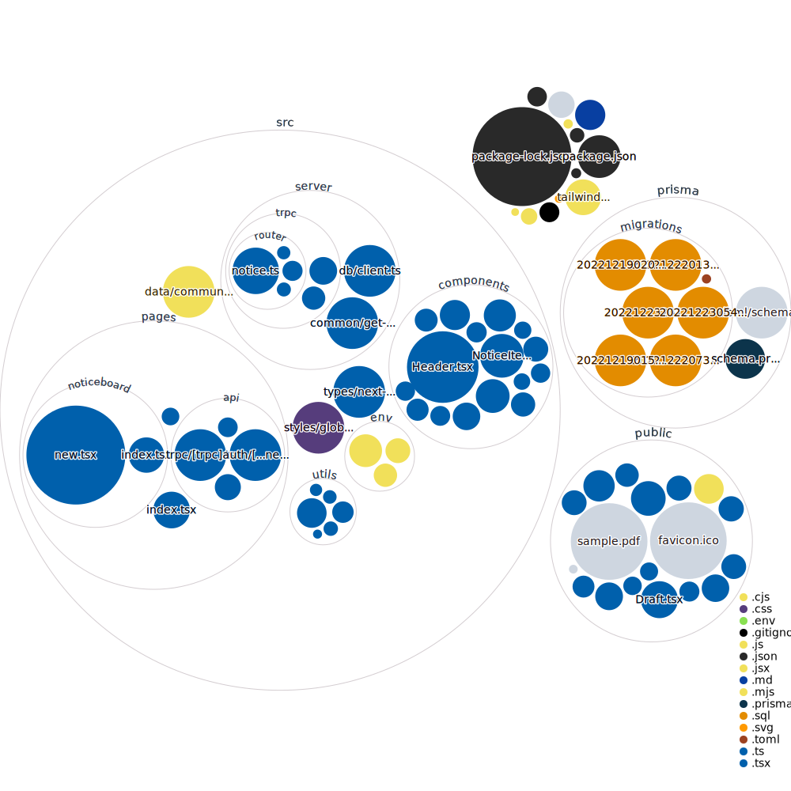

# Brisby T3 App

The Brisby app uses the [T3 Stack](https://create.t3.gg/).

Technologies include:
- React
- NextJS
- TypeScript
- Prisma
- tRPC
- React-Query
- Zustand (global state management)
- TailwindCSS
- AWS s3 (file storage) and Cloudfront (global file distribution)
- Vercel (hosting)
- NextAuth (authentication)

## Goal
The goal of this app is to build a very simple MVP as quickly as possible to show users and customers and obtain feedback. Overtime revisit areas (see Improvements and further work) as new feedback is received and more features develop. Try to keep tech debt to a minimum.

## How to use
Feel free to clone locally. However, you'll need a copy of my .env file with all the environment variables for it to work. Contact me on (mwzavattaro@icloud.com) if you'd like a copy.

Otherwise you can try these links to experiment with it:
- https://www.getbrisby.com
- https://brisby-core.vercel.app/
- https://brisby-core-mzavattaro.vercel.app/
- https://brisby-core.vercel.app/

## Improvements and further work
- Migrate from s3/Cloudfront to [Uploadthing](https://uploadthing.com/) or [Vercel Blob](https://vercel.com/docs/storage/vercel-blob)
- Further abstraction of code into their own utilities/functions outside of the components they're being used in (eg. new notice page)
- Implement backend and email invitation for adding new team members
- Implement payments (Stripe)
- Revisit Algolia search
  - Update Algolia index object when a notice is archived from the noticeboard
- Replace cursor pagination with offset paginiaton and add to noticeboard table page
- Implement Redis (not needed but would be fun) via Amazon ElastiCache or Vercel KV
- Convert HTML elements to use React components (eg <Button /> <StyledLink />). These components exist, just need to implement them throughout
- Clean up [...nextauth], remove HTML email template into its own folder for email templates
- Implement React-Email for Notice broadcasting
